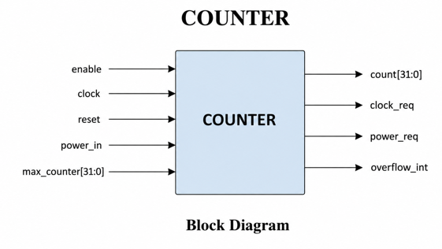
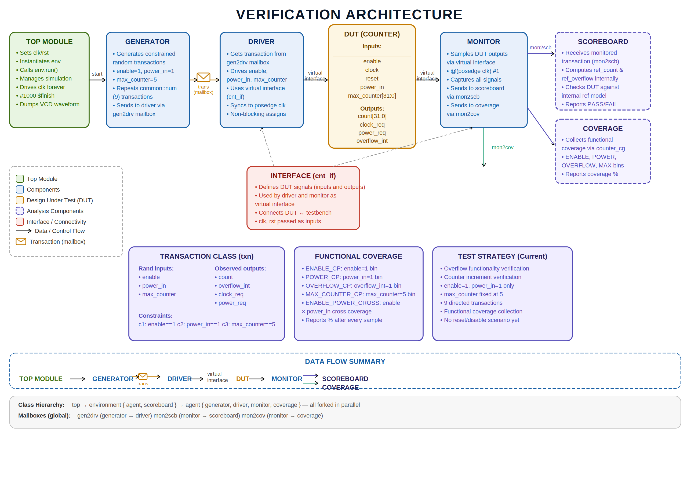
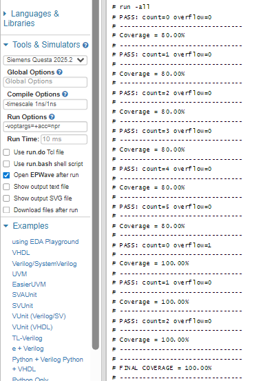
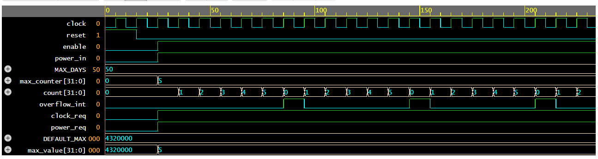
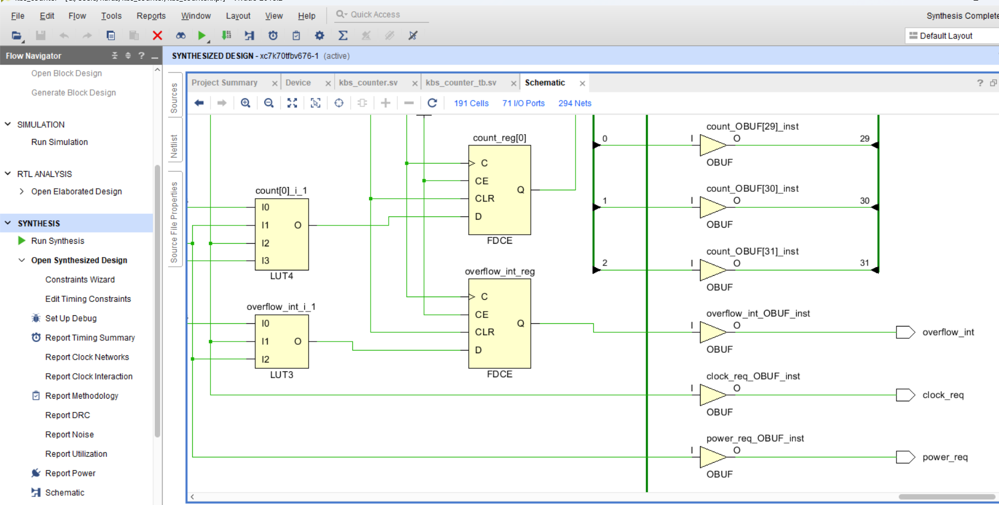
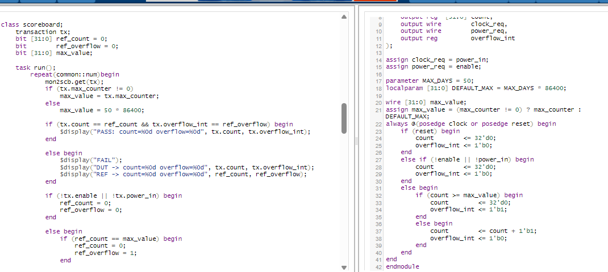

# COUNTER RTL Design and Verification using SystemVerilog

## Project Overview

This project implements a configurable 32-bit COUNTER module using Verilog/SystemVerilog along with a complete self-checking verification environment.

The design supports:
- Enable-controlled operation
- Power-aware functionality
- Configurable maximum count
- Overflow interrupt generation
- Clock and power request signaling

A SystemVerilog class-based verification environment was developed using:
- Generator
- Driver
- Monitor
- Scoreboard
- Functional Coverage
- Interface
- Mailbox Communication

---

# RTL Features

- 32-bit configurable counter
- Enable-controlled counter operation
- Power-aware counting logic
- Asynchronous reset support
- Programmable maximum count using `max_counter`
- Automatic default maximum value support
- Overflow interrupt generation
- Clock request signaling
- Power request signaling
- Safe restart behavior after reset/power disable

---

# Block Diagram



---

# Verification Architecture



Verification Flow:

```text
Generator → Driver → DUT → Monitor → Scoreboard/Coverage
```

Verification Features:
- Self-checking scoreboard
- Functional coverage
- Mailbox-based communication
- Virtual interface usage
- Constrained transaction generation

---

# Functional Coverage

Implemented covergroups:
- ENABLE_CP
- POWER_CP
- OVERFLOW_CP
- MAX_COUNTER_CP
- ENABLE_POWER_CROSS

Final Functional Coverage Achieved:

```text
100%
```

# Coverage Result



---

# Simulation Results

Observed DUT behavior:

```text
0 → 1 → 2 → 3 → 4 → 5 → overflow → reset
```

Simulation Logs:

```text
PASS: count=0 overflow=0
PASS: count=1 overflow=0
PASS: count=2 overflow=0
PASS: count=3 overflow=0
PASS: count=4 overflow=0
PASS: count=5 overflow=0
PASS: count=0 overflow=1

FINAL COVERAGE = 100%
```

# Waveform Result



---

# Synthesized Hardware Schematic

Vivado synthesized schematic of the COUNTER design:



---

# RTL and Verification Snippet



---

# Verification Methodology

- Generator creates constrained transactions
- Driver drives DUT inputs through virtual interface
- Monitor samples DUT outputs
- Scoreboard compares DUT outputs with reference model
- Coverage component measures functional coverage
- Mailbox communication used between components
- Self-checking verification methodology implemented

---

# Tools Used

- Verilog/SystemVerilog
- QuestaSim
- EDA Playground
- Vivado

---

# Repository Structure

```text
COUNTER-SystemVerilog-Verification/
│
├── rtl/
│   └── Design.sv
│
├── tb/
│   └── Testbench.sv
│
├── 
│   ├── Block_diagram.png
│   ├── verification_architecture.png
│   ├── Waveform.png
│   ├── Coverage_result.png
│   ├── Schematic.png
│   ├── Snippet.png
│   └── COUNTER_RTL_Verification_Specification.pdf
│
└── README.md
```

---

# Applications

- Low-power SoC designs
- Embedded controllers
- Watchdog timers
- Event timeout detection
- Power-aware digital systems
- Time-based monitoring systems

---

# Specification Document

[COUNTER RTL Verification Specification](COUNTER_RTL_Verification_Specification.pdf)

---

# Conclusion

This project successfully demonstrates:
- RTL Design
- SystemVerilog Verification
- Functional Coverage
- Scoreboard-based checking
- Mailbox communication
- Verification architecture development

The project includes:
- Self-checking verification environment
- Functional coverage collection
- Waveform analysis
- Synthesized hardware schematic verification

---

# Author

**Narasimhamurthy B**

SystemVerilog RTL & Design Verification Enthusiast
